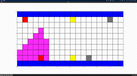

# Pre-requisites

 - Benchmark `*.infile` circuits within a subdirectory named `benchmarks`
 - `pip install matplotlib`
 - (optional) `pip install pytest`

# Usage

 - `py asn1.py` for visualizing A* and Lee-Moore 
 - `pytest` for running unit tests
 - Open `asn1.py` to modify variables for configuration

---

# Examples

Lee-Moore

A*

